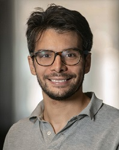
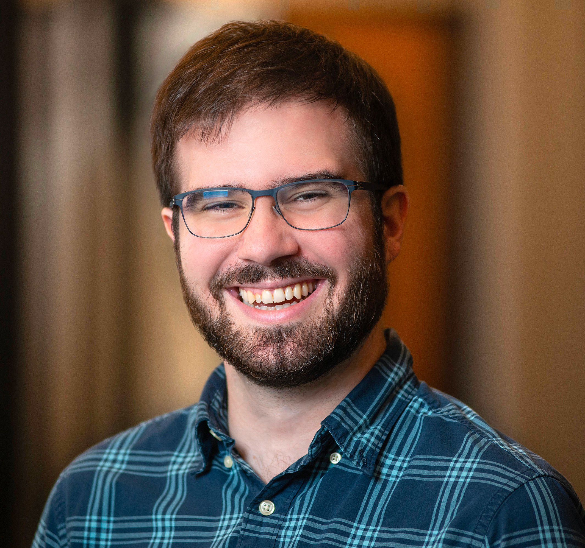
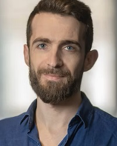
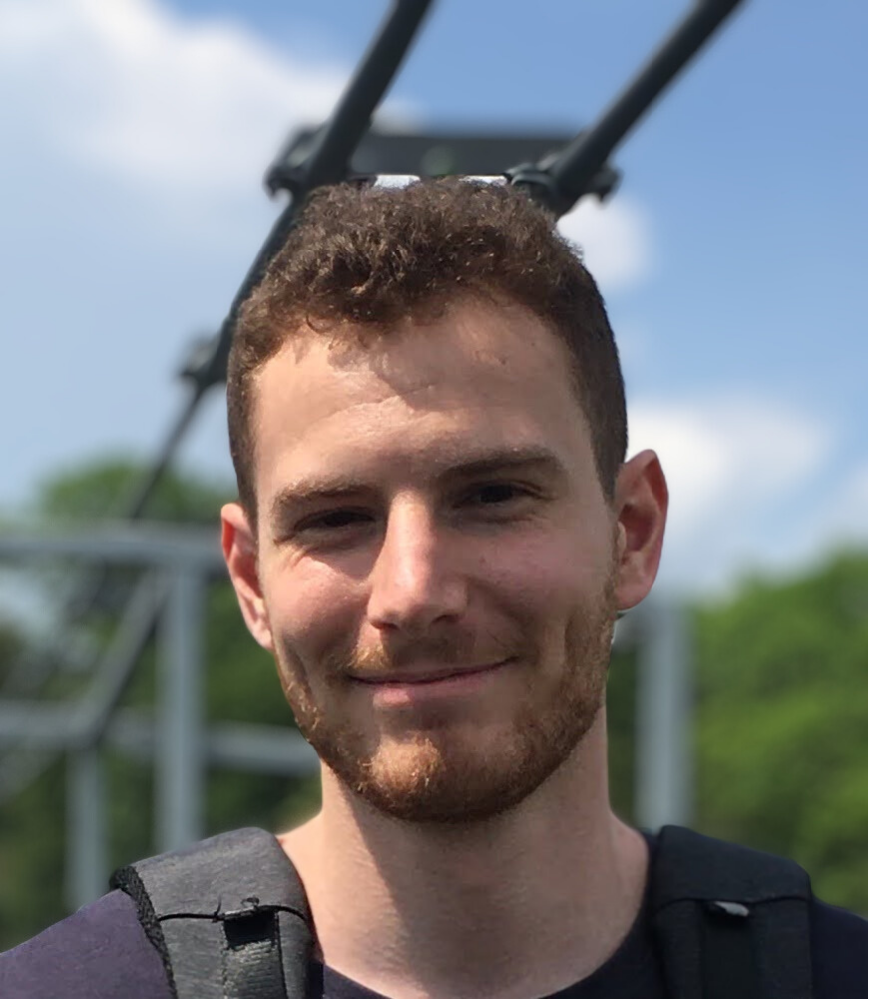
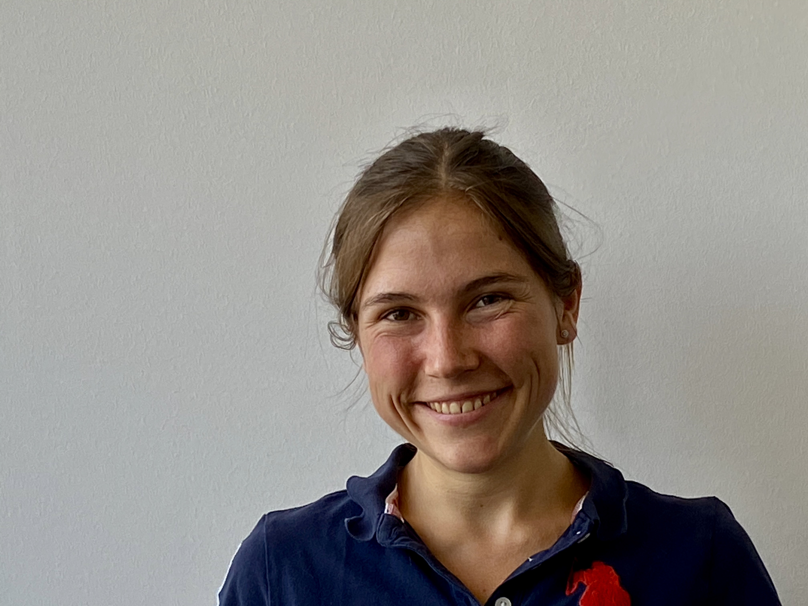
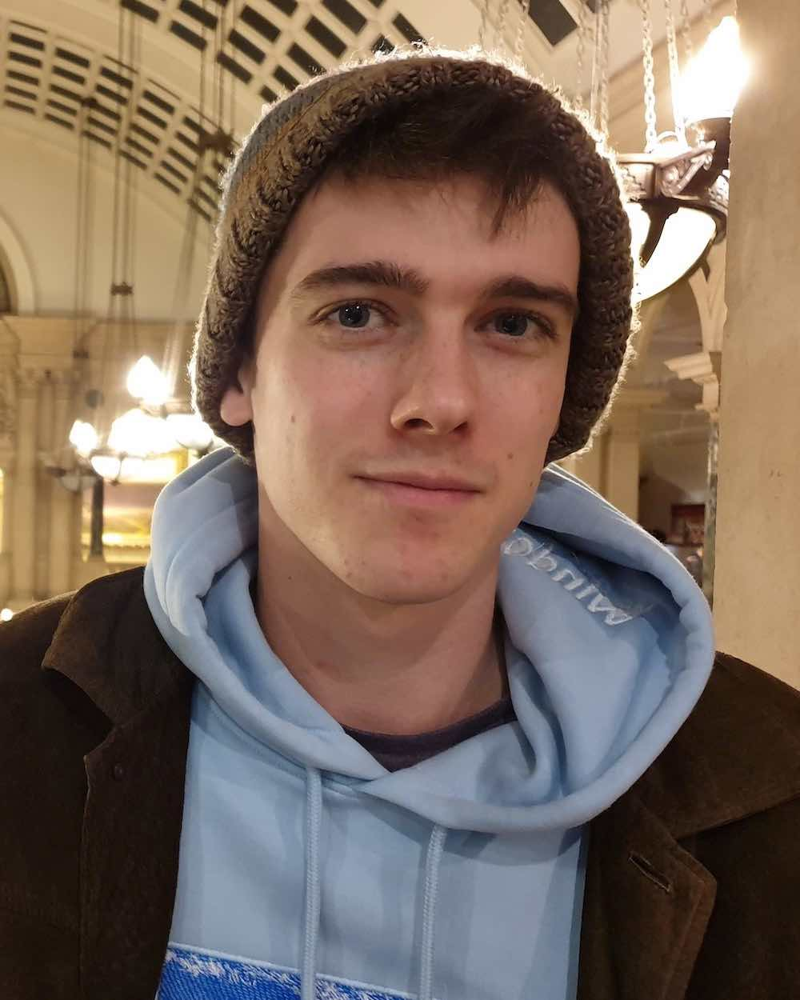
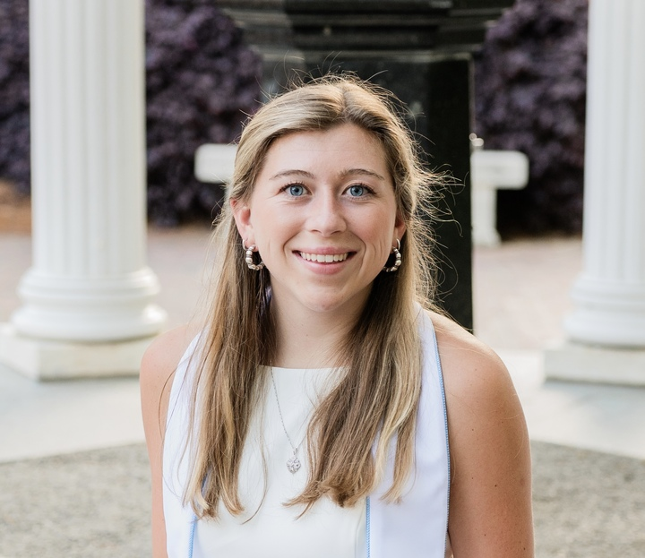
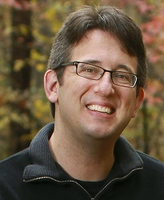

---
# Feel free to add content and custom Front Matter to this file.
# To modify the layout, see https://jekyllrb.com/docs/themes/#overriding-theme-defaults

layout: home
---

# About

The NeuroRSE group at Flatiron Institute Center for Computational Neuroscience builds and maintains open source software for computational and systems neuroscience. We intend to create solid packages that can be relied and built upon, rather than chasing cutting-edge research.

**What does RSE mean?** A "research software engineer", which is defined by the [US-RSE professional organization](https://us-rse.org/about/what-is-an-rse/) as someone "who regularly use expertise in programming to advance research".



# Workshops

<ul class="post-list">
  <li>
    June 2024
    <h3>
      <a class="post-link" href="/workshops/fens-2024">FENS 2024</a>
    </h3>
  </li>
  <li>
    February 2024
    <h3>
      <a class="post-link" href="https://nemos-workshop-feb-2024.readthedocs.io/en/latest/">Nemos 2024</a>
    </h3>
  </li>
</ul>

<!-- - [nemos February 2024](https://nemos-workshop-feb-2024.readthedocs.io/en/latest/) -->

# Our Projects

All of our projects are open-source python packages. We are always happy to get external contributors and happy to help new users get started!



# Members

## [Edoardo Balzani](https://www.simonsfoundation.org/people/edoardo-balzani/)

Edoardo is the one of the principal developers of Nemos, a package for statistical modeling of neural activity.  He earned his Ph.D. in Neuroscience from the Italian Institute of Technology in Genova, under the guidance of Valter Tucci. Before joining the Flatiron institute as a data scientist, he worked as a postdoc in Cristina Savin's lab at NYU's Center for Neural Science where he developed statistical methods for the analysis of neural spike trains during naturalistic behavior.

## [Billy Broderick](https://wfbroderick.com)

Billy Broderick received his Ph.D. from NYU's Center for Neural Science, where he was advised by Eero Simoncelli and Jon Winawer. During his Ph.D., he studied how vision changes across the visual field using fMRI, psychophysics, and computational models. Before that, he worked as a research assistant at Duke University, spent a year at South China Normal University in Guangzhou, China as a [Luce Scholar](http://www.hluce.org/lsprogram.aspx), and got his B.A. in neuroscience and mathematics at Oberlin College

## [Guillaume Viejo](https://www.simonsfoundation.org/people/guillaume-viejo/)

Guillaume Viejo joined the Center for Computational Neuroscience as a data scientist, where he focuses on developing software for analyzing neurophysiological data. He holds a Ph.D. in computational neuroscience from the Institute of Intelligent Systems and Robotics at the Pierre and Marie Curie University in Paris, France. After completing his doctorate, Guillaume worked as a postdoctoral fellow at the Montreal Neurological Institute, where he studied the head-direction system (also known as the brain’s compass) in rodents.

# Interns

## Bence Bagi

Bence is currently a Ph.D. student at Imperial College London, under the supervision of Juan Gallego. In his research he relies on data analysis and computational modeling to investigate how neural populations give rise to skilled movement. Before his Ph.D., he completed his master's at the Bernstein Center for Computational Neuroscience (BCCN) Berlin.

## [Hanna Dettki](https://www.notion.so/haannaa/Hanna-D-efc816633dc84f1d86bd0da6efbddf5a?pvs=4)

Hanna is a Master’s student in psychology at New York University and in computer science at the University of Tuebingen, Germany. She’s interested in both human and artificial intelligence and how to bridge the gap between the two. Specifically, she is interested in using computational methods to model and better understand the complexities of our mind, brain, and behavior. Prior to starting her Master’s degree at NYU on a Fulbright scholarship, she studied cognitive and computer science at the National Cheng Kung University, Taiwan, Hong Kong University, and the University of Tuebingen, where she received her B.Sc.

## Kipp Freud

Kipp is currently undertaking a PhD within the Computational Neuroscience Unit at the University of Bristol, where he is supervised by Cian O'Donnell, Matt W. Jones, and Nathan Lepora. His research examines spatial and navigational respresentations in the hippocampus, and how and why these representations change over time. At Flatiron, Kipp is developing signal processing tools for pynapple to expand it's utility for analysis of local field potential data.

## Caitlin Lewis

Caitlin received her B.S. in Computer Science and Statistics from UNC Chapel Hill. During this time she worked as an Undergraduate Research Assistant in the lab of Dr. Adam Hantman - where she helped to develop software tools for calcium imaging analysis and automated behavioral classification. She is also the co-developer of fastplotlib, a cutting-edge scientific visualization library. Caitlin will begin pursuing her PhD in Electrical and Computer Engineering this coming Fall at Duke University in the lab of Dr. John Pearson.

# Group Alumni

## [Eric Thomson](https://ericthomson.net)

Eric helped maintain CaImAn, the calcium imaging analysis platform. His main goal is to build software that works well and is accessible to experimentalists. He received his PhD in neuroscience from UCSD before working as a postdoc at Duke University with Miguel Nicolelis on sensory prosthetic systems. He then worked in  computational optics with Roarke Horstmeyer and Eva Naumann, helping to develop a multi-camera microscope system. Before coming to Flatiron, Eric was a data scientist at NIH/NIEHS, working with multiple neuroscience labs to analyze calcium imaging and electrophysiology data.

